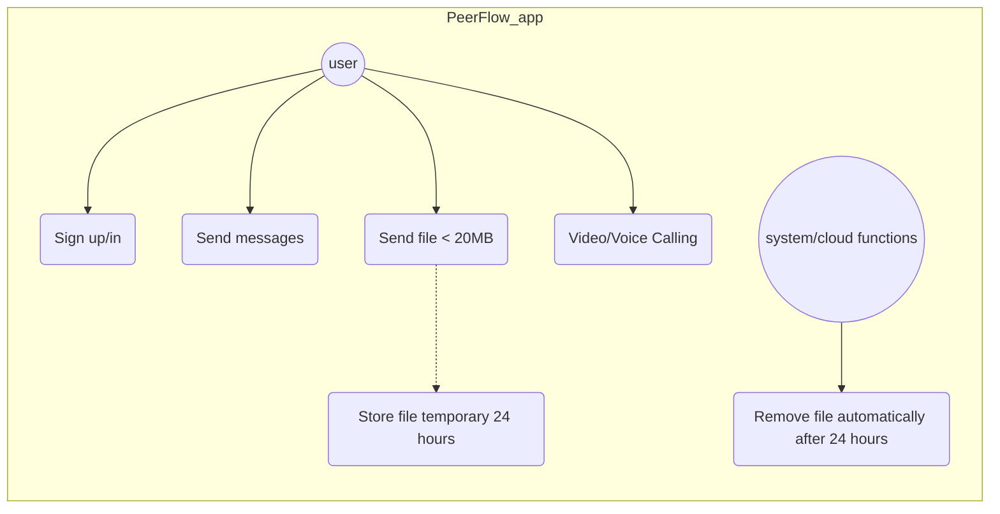

```mermaid
graph LR
	User((user))
	System((system/cloud functions))
	
	subgraph PeerFlow_app
		User --> UC1(Sign up/in)
		User --> UC2(Send messages)
		User --> UC3(Send file < 20MB)
		User --> UC4(Video/Voice Calling)
		UC3 -.-> UC5(Store file temporary 24 hours)
		System --> UC6(Remove file automatically after 24 hours)
	end
```
