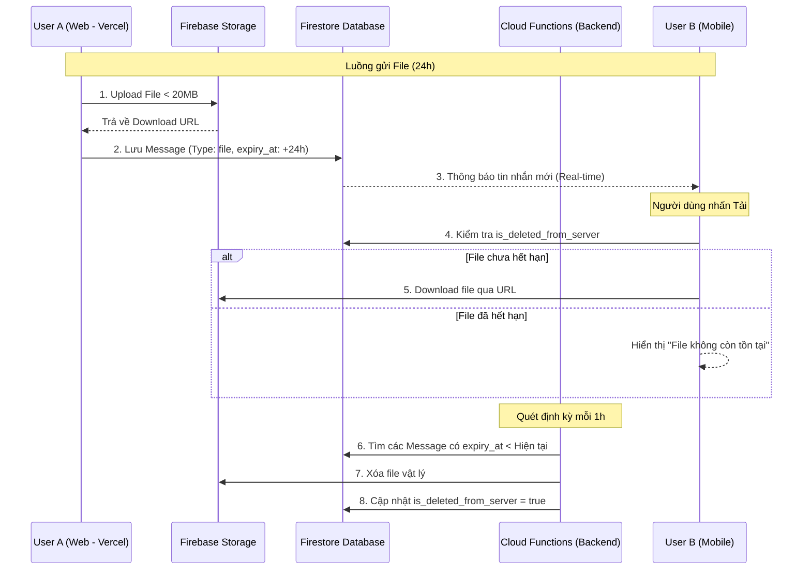

```mermaid
sequenceDiagram
    participant UserA as User A (Web - Vercel)
    participant FS as Firebase Storage
    participant DB as Firestore Database
    participant CF as Cloud Functions (Backend)
    participant UserB as User B (Mobile)

    Note over UserA, UserB: Luồng gửi File (24h)
    UserA->>FS: 1. Upload File < 20MB
    FS-->>UserA: Trả về Download URL
    UserA->>DB: 2. Lưu Message (Type: file, expiry_at: +24h)
    DB-->>UserB: 3. Thông báo tin nhắn mới (Real-time)
    
    Note over UserB: Người dùng nhấn Tải
    UserB->>DB: 4. Kiểm tra is_deleted_from_server
    alt File chưa hết hạn
        UserB->>FS: 5. Download file qua URL
    else File đã hết hạn
        UserB-->>UserB: Hiển thị "File không còn tồn tại"
    end

    Note over CF: Quét định kỳ mỗi 1h
    CF->>DB: 6. Tìm các Message có expiry_at < Hiện tại
    CF->>FS: 7. Xóa file vật lý
    CF->>DB: 8. Cập nhật is_deleted_from_server = true
```
